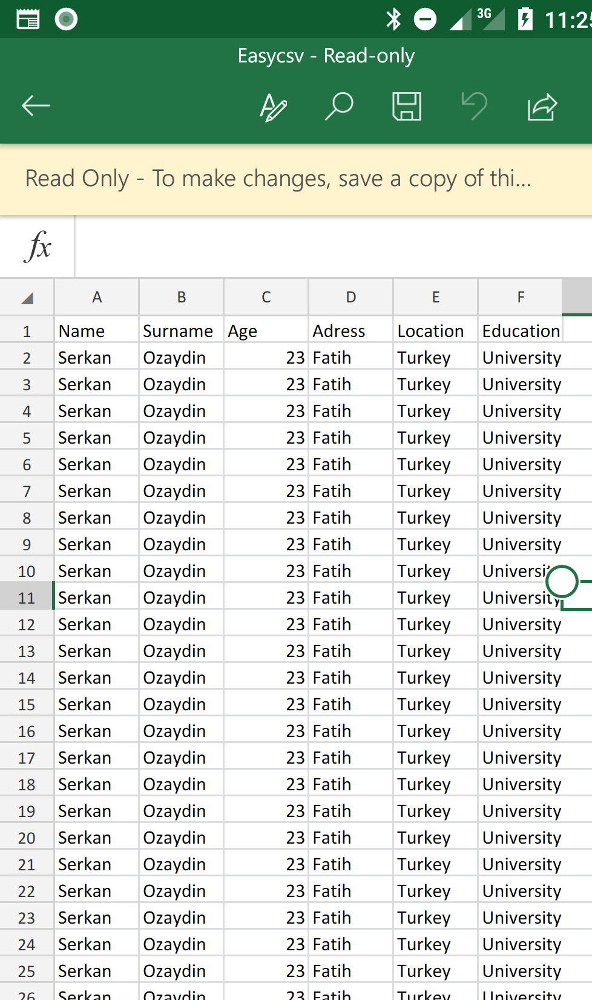

#  easy-csv

Creates csv file for android




##  Download

**Add it in your root build.gradle at the end of repositories:**

<pre>

allprojects {

repositories {
...
    maven { url 'https://jitpack.io' }
    }
}

</pre>

  

**Add the dependency**

<pre>

dependencies {
implementation 'com.github.hsmnzaydn:easy-csv:1.0.0'
}

</pre>

  

##  Use Steps

**Step 1: Create EasyCsv Object**

``` java

EasyCsv easyCsv = new EasyCsv(MainActivity.this);

```
* to output the file in diffrent charset create EasyCsv object with below constructer
``` java

EasyCsv easyCsv = new EasyCsv(MainActivity.this, StandardCharsets.YOUR_CHOOISE);

```


**Step 2: Create your headerlist and datalist**

``` java
List<String> headerList = new ArrayList<>();
headerList.add("Name.Surname.Age-");

List<String> dataList = new ArrayList<>();
dataList.add("Serkan.Ozaydin.23-");

```

**Step 3: Select separators for column and line**

``` java
easyCsv.setSeparatorColumn(".");
easyCsv.setSeperatorLine("-");
```

**Step 4: Select separators for column and line**

``` java

/**
* @param fileName Name of the file to be created
* @param WRITE_PERMISSON_REQUEST_CODE EasyCsv request runtime permission for Write permission to user. When user "Accept" or "Decline" for you can handler
*/
easyCsv.createCsvFile(fileName, headerList, dataList WRITE_PERMISSON_REQUEST_CODE, new FileCallback() {
@Override
public void onSuccess(File file) {
}

@Override
public void onFail(String err) {
}
});

```
# Changelog
* 3/5/2020
— you can output the file with chosen Charset like UTF-8 and UTF-16 etc ...

# License
<pre>
Copyright 2018 Huseyin Serkan Ozaydin

Licensed under the Apache License, Version 2.0 (the "License");
you may not use this file except in compliance with the License.
You may obtain a copy of the License at

   http://www.apache.org/licenses/LICENSE-2.0

Unless required by applicable law or agreed to in writing, software
distributed under the License is distributed on an "AS IS" BASIS,
WITHOUT WARRANTIES OR CONDITIONS OF ANY KIND, either express or implied.
See the License for the specific language governing permissions and
limitations under the License.
</pre>
